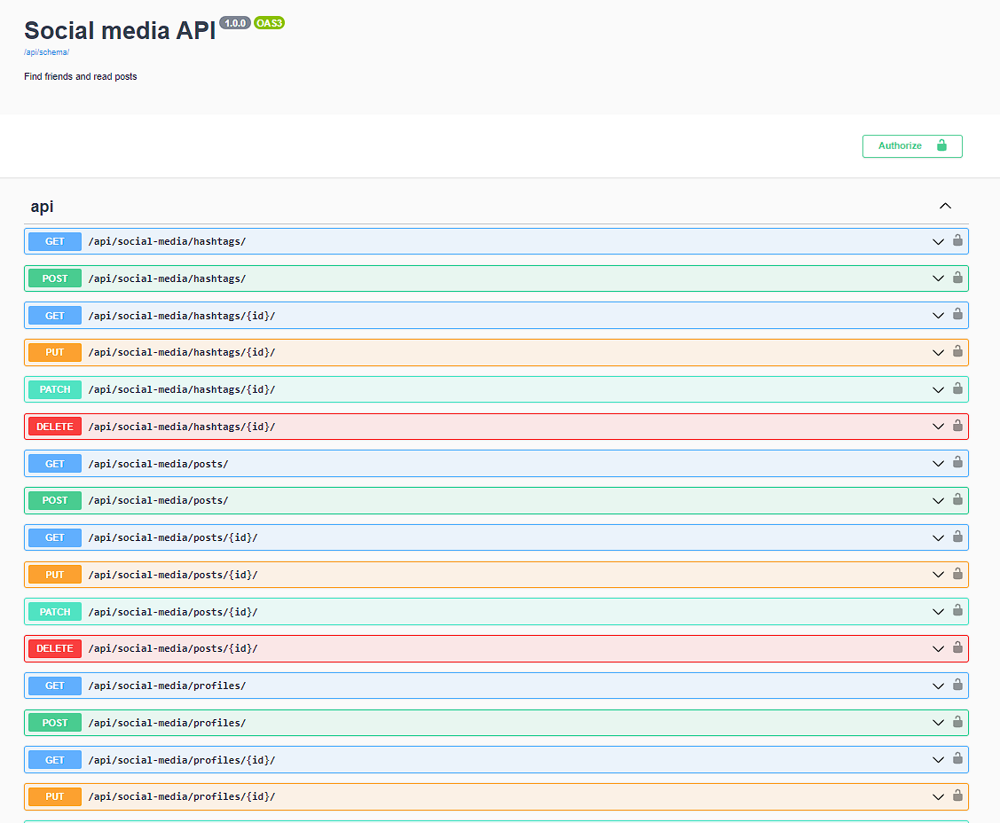

# 🧑‍🤝‍🧑Social media platform API👪
The API should allow users to create profiles, follow other users, and perform basic social media actions.

## 🌍Installing using GitHub:
```shell
git clone https://github.com/NazarHladaniuk/Social_media_platform_API.git
python -m venv venv
venv\Scripts\activate (on Windows)
source venv/bin/activate (on macOS)
pip install -r requirements.txt
python manage.py makemigrations
python manage.py migrate
python manage.py runserver
```
✍️Add your environment variables to .env
- SECRET_KEY="Your generated secret key for this project"

## 👋Getting access for users
```shell
create user vis /api/user/register/
get access token via /api/user/token/
```

## 🌟Features:
- JWT authenticated
- Admin panel /admin/
- Personalized posts page
- Hashtags system
- Follow/Unfollow
- Profile pictures for users
- Documentation is located at /api/doc/swagger/

## 👀Images


